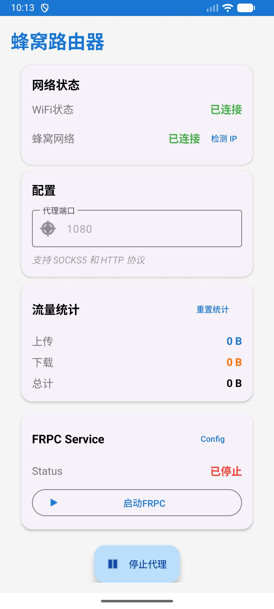

# CellularRouter - 蜂窝网络路由器

一个Android应用，提供SOCKS5和HTTP代理服务，将WiFi流量通过蜂窝网络转发，实现共享手机蜂窝网络IP的功能。

## 应用截图



## 功能特性

### 核心代理功能
- ✅ **统一端口代理**: SOCKS5和HTTP协议共用一个端口
- ✅ **自动协议检测**: 自动识别SOCKS5和HTTP请求
- ✅ **蜂窝网络绑定**: 所有代理流量强制通过蜂窝网络
- ✅ **流量统计**: 实时显示上传/下载流量
- ✅ **简洁界面**: Material Design 3风格UI
- ✅ **前台服务**: 保持代理服务持续运行

### FRPC集成 (v0.65.0)
- ✅ **内网穿透**: 通过frp服务器将本地代理暴露到公网
- ✅ **WiFi专用**: FRPC流量走WiFi，代理流量走蜂窝
- ✅ **加密传输**: 支持TLS、压缩和加密
- ✅ **双协议支持**: STCP和XTCP代理类型
- ✅ **配置加密**: 敏感信息使用系统加密存储
- ✅ **独立控制**: FRPC服务独立启停
## 系统要求

- Android 6.0 (API 23) 或更高版本
- 设备需要支持蜂窝网络

## 使用方法

1. 确保设备已连接蜂窝网络
2. 打开应用，配置代理端口（默认1080）
3. 点击"启动代理"按钮
4. 在其他设备上配置代理：
   - **SOCKS5代理**: `手机IP:端口`
   - **HTTP代理**: `手机IP:端口`
5. 流量将通过手机的蜂窝网络转发

### FRPC配置（可选）

FRPC功能可将本地代理通过frp服务器分享到外网：

1. 确保手机已连接WiFi网络
2. 点击菜单中的"配置FRPC"
3. 填写frp服务器信息：
   - 服务器地址和端口
   - 认证Token
   - 代理类型（STCP/XTCP）
   - 密钥
4. 保存配置后，点击"启动FRPC"
5. FRPC通过WiFi连接服务器，本地代理通过蜂窝网络工作

详细配置说明：[FRPC使用文档](FRPC_USAGE.md)

## 技术架构

- **语言**: Kotlin
- **最低SDK**: API 23 (Android 6.0)
- **目标SDK**: API 34 (Android 14)
- **协议支持**: SOCKS5 (RFC 1928), HTTP/HTTPS CONNECT
- **网络绑定**: ConnectivityManager + Network.bindSocket()
- **并发处理**: Kotlin Coroutines
- **UI框架**: Material Design 3

## 项目结构

```
app/src/main/java/com/cellularrouter/
├── MainActivity.kt                    # 主界面
├── ProxyService.kt                    # 代理前台服务
├── TrafficMonitor.kt                  # 流量统计
├── data/
│   └── ProxyConfig.kt                 # 代理配置管理
├── network/
│   └── NetworkManager.kt              # 网络管理（蜂窝+WiFi）
├── proxy/
│   ├── UnifiedProxyServer.kt          # 统一代理服务器
│   ├── Socks5Handler.kt               # SOCKS5处理器
│   └── HttpHandler.kt                 # HTTP处理器
└── frpc/
    ├── FrpcConfig.kt                  # FRPC配置管理
    ├── FrpcManager.kt                 # FRPC进程管理
    └── FrpcService.kt                 # FRPC前台服务
```

## 构建

### 使用Android Studio（推荐）

1. 打开Android Studio
2. 选择 "Open an Existing Project"
3. 导航到 `/Users/liuping/project/CellularRouter` 目录
4. 等待Gradle同步完成
5. 点击 "Build" → "Build Bundle(s) / APK(s)" → "Build APK(s)"
6. 或直接点击运行按钮安装到连接的设备

### 使用命令行

如果已安装Gradle或Android SDK中的Gradle:

```bash
# 构建Debug APK
gradle assembleDebug

# 或使用Android SDK中的Gradle
$ANDROID_HOME/tools/bin/gradle assembleDebug
```

生成的APK位置: `app/build/outputs/apk/debug/app-debug.apk`

## GitHub Actions 自动构建

本项目配置了GitHub Actions，支持自动化构建：

### 手动构建Release APK

1. 访问GitHub仓库的 **Actions** 页面
2. 选择 **Build Release APK** 工作流
3. 点击 **Run workflow**
4. 输入版本号（如：1.0.0）
5. 构建完成后从Artifacts下载APK

### 自动构建Debug APK

每次推送到main分支或创建Pull Request时，会自动构建Debug APK。

详细说明请查看: [GitHub Actions文档](.github/ACTIONS.md)

## 许可证

MIT License
